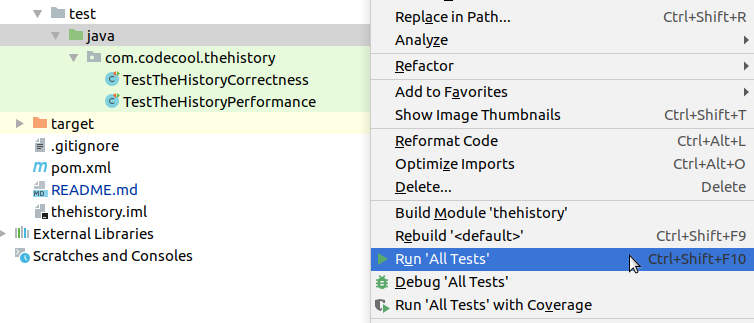

Petunia is a decent little country with a strong and wise leader.
He sets wise laws in order to keep the country safe, stable, and prosperous.
For example it is forbidden to use the word 'dictator' since it induces
uneasiness and threatens peace.

Pet Un, the wise leader, likes if the history of the country reflects all
the up to date information scholars have at any given moment. There is a
central, authoritative source of information about historical facts
called `TheHistory` which must be updated by historians any time they become
aware of a new piece of fact.

For example, some would mistakenly say that the country's main victories
have been fought at the time Pet Un's father, Pet Il was in rule - this
is an example of dangerous and misleading information that has to be erased
and set straight in the official version.

And another thing. Performance is of utmost importance; Pet Un personally
ordered that `TheHistory` must be as fast as possible.

The IT specialists at _The History Institute_ chose to keep the current
state of history as a bunch of words. They knew about
arrays, but also heard that there are multiple list implementations in Java
to choose from with different performance characteristics. They piloted a
research project to check the difference between String[], ArrayList<String>,
and LinkedList<String>. Help them to implement all the necessary methods
with the best possible performance!

1) So your main task is to fill the //TODO sections. removeWord() is the
easiest, replaceMoreWords() is much more tricky. Try your best to implement
everything but you should leave the replaceMoreWords() last because that will
devour most of your time.

2) To get better performance, you should look up iterator and ListIterator
where it is needed (see the Tips section)!
Every test (correctness and performance) should pass! Also check the times needed to
perform the tasks when you are ready.

### Tips

- You don't need iterators for Arrays but check for the System.arraycopy() and
the Arrays package for helper functions. As you know you can't resize this type
of array so when you are adding an element you should create an other array
with the correct size and copy the existing and new elements into it.

- You should definitely use iterators for LinkedList. Be careful, if you use
the .get() method, that will destroy the LinkedList's performance.
But why? (Search for the answer and if you can't find or understand the reasons
ask the mentors). It is really tricky to solve the replaceMoreWords() with only
iterators so if you can't figure it out just make it work
somehow and ask about it. :)

- In case of ArrayList you are free to use iterators and/or the .get() method
because it doesn't have much impact on it's performance (read about the whys,
search for the implementation details of ArrayList).

- You don't need to do much with the interface but you should definitely
examine it! It's an easy example of an interface, maybe a bit too basic but
also easier to understand than most interfaces which can be found in the wild.

### Running the tests

You should be able to run tests in IntelliJ by right-clicking the test folder
(`src/test/java/`) and selecting "Run All Tests":

You can also run a single class, or a single test, by clicking the green "play"
icon:

If you run into problems with IntelliJ configuration, check out
[JUnit step by step](https://learn.code.cool/krk-oop-java/#/pages/19-java-se-6th-si-tw-with-tests/5-idea-junit-step-by-step).
 However, remember we are using **JUnit 4** (not 5) in this project, because it
 has better support for parameterized tests.

 If all else fails, you can run the tests using Maven (`mvn test` in console), but
 the output will not be very readable.

### More about the tests

There are two test classes. Each test in these classes is being run in 3 variants:
`[Array]`, `[ArrayList]`, and `[LinkedList]`.

1. `TestTheHistoryCorrectness` - these tests check if your code is returning
  the right answer. If they fail, you probably have a bug.

2. `TestTheHistoryPerformance` - these check how fast your code is on bigger
   data sets. Each test has a 5-second timeout. If a test fails due to timeout,
   that probably means a given operation could be implemented in a better way.

   To improve performance, make sure you understand how `ArrayList` and
   `LinkedList` classes work, and what are the differences between them!
